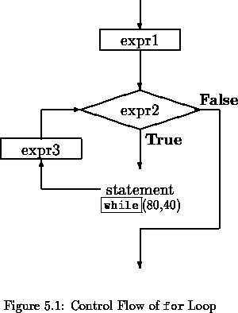
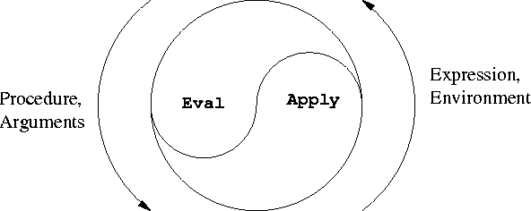
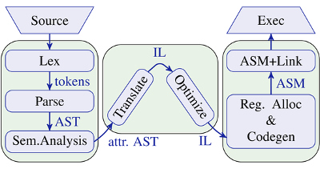

# Макросы

## Выражения vs утверждения

Выражения (expressions) — код, который в результате выполнения возвращает значение
и может быть использован справа в операторе присваивания. Пример: `2 + 2`, `foo(bar)`.

Утверждения (statements) — код, который только выплняется, но не возвращает значения
и не может быть использован в присваивании. Во многих языках все операторы управления являются утверждениями. Пример:

    if True:
        foo()
    else
        bar()

В Lisp'е всё — выражение. Это кардинально упрощает очень многие вещи и является одной из предпосылок для активного использования макросов для определения собственных управляющих конструкций. Вторая предпосылка — функции как первоклассный объект.

## Правило исполнения кода

В Lisp'е довольно четко определены 3 "времени" (режима) работы программы:

- время выполнения (runtime) — обычный режим исполнения программ — такой же, как и для програм на других языках
- время компиляции — время, когда работает компилятор. В отличие от других языков, в Lisp'е есть интерфейс управления работой системой в этот период
- время загрузки кода

Стандартное правило исполнения кода в Lisp'е, которое работает во время выполнения — форма `(fn arg1 arg2 ...)` вычисляется следующим образом:

1. Сначала вычисляются аргументы `arg1`, `arg2` и т.д. (слева-направо): если это атомы — то сами в себя, если переменные — то берется их значение, если формы — вычисляются по тому же правилу.
2. Затем к ним применяется функция, которая привязана к символу `fn`.

Однако, стандартное правило работает не всегда. На самом деле, действует более общее правило:

1. Сначало определяется, что находится в первой позиции формы. Это может быть: функция, макрос или базовый оператор (`special-operator`).
2. Для функций применяется стандартное правило.
3. Базовые операторы — это 25 операторов, на которых построен весь язык. Условно говоря, это аксиомы языка, которые реализуются уже в более низкоуровневом коде. На них строятся все остальные конструкции языка. Правило выполнения у каждого базового оператора — своё.
4. А для макросов действует такое правило: на место вызова макроса подставляется код, который формируется макросом, а аргументы вызова передаются в этот код без предварительного вычисления.

Т.е. **макрос** — это конструкция, которая задает преобразование одного кода в другой. Компилятор/интерпретатор любого языка программирования выполняет эту функцию — преобразования кода на этом языке в код (обычно) на другом языке, который будет исполняться. Макрос — это интерфейс к компилятору, который дает возможность выполнять такие же преобразования наравне с компилятором.

## Макрос как шаблон

`if` является базовым оператором. Поверх него реализовано множество других управляющих конструкций: `when`, `unless`, `cond`, `case`/`ecase`, ...

Макрос `cond` — это `if` с возможностью выполнять последовательную проверку нескольких условий:

    (cond
      ((> x 0) 1)
      ((> y 1) 2)   ; переменные x и y описаны где-то за пределами cond
      (t 3))        ; t всегда матчится - это вариант по-умолчанию

Если выразить этот `cond` через `if`, то он будет выглядеть так:

    (if (> x 0) 1
        (if (> y 1) 2
            3))

Также его можно выразить в более общем виде, который поддерживает любое
количество условий в `cond`. В данном случае для этого можно использовать рекурсию:

    (if (> x 0) 1
        (cond
          ((> y 1) 2)
          (t 3)))

Макросы позволяют автоматизировать такое приведение одних форм к другим.
Макрос исполняется в 2 этапа: на этапе компиляции его код вычисляется и результат вставляется в код на месте, где был макрос.
На этапе выполнения кода макроса уже не существует, а исполняется уже сгенерированный код.

Можно создать макрос `cond`, который будет генерировать приведенный выше код так:

    (defmacro cond1 (&body clauses)
      `(if ,(first (first clauses)) ,(second (first clauses))
           (cond1 ,@(rest clauses))))

В макросах часто используется конструкция ``(... ,x ...)`.
Ее можно назвать шаблоном кода, в котором участки, отмеченные запятыми, вычисляются сразу.
Это аналог обычного экранированного списка (`'(1 2 3)`)
с той разницей, что в отличие от простой кавычки (') обратная кавчка (\`)
поддерживает операции "разэкранирования" (,) и "разэкранирования с развертыванием(splicing)" (,@),
которые вычисляют форму, находящуюся за ними.
Таким образом можно создавать шаблоны: ``(list 1 ,x ,y)` —
вычислив его мы получим форму с функцией `list` и тремя аргументами:
константой 1, а также двумя занчениями, которые находятся в переменных `x` и `y`,
опеределенных где-то за пределами шаблона. Если значения `x` и `y` — 2 и 3 соответственно,
то результат вычисления этого шаблона: `(list 1 2 3)`.
А шаблон ``(list 0 ,@x)`, который при условии, что `x` — это список `'(1 2 3)`,
развернется в такой код: `(list 0 1 2 3)`.

## Отладка макросов

Поскольку макросы не существуют наэтапе выполнения, для их отладки нужны отдельные инструменты.
Функция `macroexpand-1` раскрывает макрос и печатает код, который будет им сгененрирован.

    CL-USER> (defmacro cond1 (&body clauses)
               `(if ,(first (first clauses)) ,(second (first clauses))
                    (cond1 ,@(rest clauses))))
    CL-USER> (macroexpand-1 '(cond1
                               ((> x 0) 1)
                               ((> y 1) 2)
                               (t 3)))
    (IF (> X 0)
        1
        (COND1
          ((> Y 1) 2)
          (T 3)))

## Применения макросов

Макросы могут применятся для разнообразных задач, хотя общее правило таково, что не стоит писать макрос там,
где можно обойтись обычной функцией.

Основные применения:

- Формирование языка. Сам Common Lisp построен во многом из макросов, включая такие его системы, как CLOS (объектная система).
  С помощью макросов можно расширять язык новыми управляющими конструкциями и операторами.
  Точно также из макросов можно построить язык альтернативный Common Lisp на платформе самого Lisp'а.
  В более практичной сфере это позволяет создавать т.н. DSL'и — специфические языки для какой-то сложной предметной области.
- Автоматизация генерации кода.
- Оптимизация скорости работы программы за счет перенесения части вычсилений на этап компиляции.

## Задание

1. Прочитайте:
[Macros: Standard Control Constructs](http://www.gigamonkeys.com/book/macros-standard-control-constructs.html) и
[Macros: Defining Your Own](http://www.gigamonkeys.com/book/macros-defining-your-own.html)

2. Макрос `doindex` — это аналог `dolist`, который дополнительно дает доступ к индексу текущего элемента в списке. Например:

        CL-USER> (dolist (x '(a b c))
                   (print x))
        A
        B
        C
        CL-USER> (doindex (i x '(a b c))
                   (print (list i x)))
        (0 A)
        (1 B)
        (2 C)

  Заполните ... в реализации этого макроса:

        (defmacro doindex ((index element) list)
          ...)

3. Можно ли в Lisp'е создать макрос-аналог выражения `for` в Python,
   который бы позволял итерацию по любой структуре, которая реализует итератор?
   Если да, то как (в общих чертах)?

4. По желанию прочитайте [Casting SPELs in Lisp](http://www.lisperati.com/casting.html)
