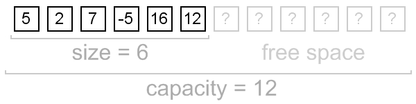
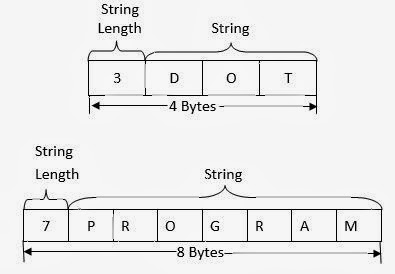
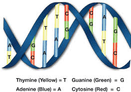
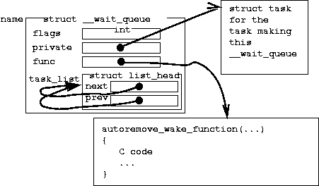

# Базовые структуры данных

## Список

Список — это базовая структура данных Lisp'а. Это классический связный список.

Создать список можно как константу с помощью буквального представления: `'(1 2 3)`.
Либо с помощью функции `list`: `(list 1 2 3)`. В этом случае его содержимое можно изменять.

Добавление элементов в голову списка: `(cons 0 '(1 2 3)) => '(0 1 2 3)`.
Сразу несколько элементов добавлять в начало списка можно с помощью: `(list* 0 1 '(2 3)) => '(0 1 2 3)`. 
`(push 0 list)` — этот макрос сделает то же, что и `cons`, и при этом обновит значение переменной `list`.
Сложить 2 списка можно с помощью `(append list1 list2)`, которая создаст новый список с элементами сначала из `list1`, а потом `list2`.
Обращение к элементу списка по номеру — `(nth 1 '(1 2 3)) => 2`.
Первый элемент в списке — `(car list)`, хвост списка — `(cdr list)`.
Это исторические названия, у которых есть "современные" аналоги: `first` и `rest`.
Однако, преимущества `car`/`cdr` в том, что у них есть легкая возможность расширения:
например, `cadr` — первый элемент хвоста списка, т.е. второй элемент списка (`second`),
а `cdddr` — это третий хвост списка, т.е. `(cdddr '(0 1 2 3)) => (3)`. И т.п.

Большинство операций работы со списком рассматривает его как **функциональную**, т.е. неизменяемую структуру данных.
Однако, есть и т.н. **деструктивные** операции, которые меняет значение в структуре.
Например, операция `(nconc list1 list2)` работает так же, как и `append`,
но она вернет не новый список, а изменит `list1`, присоединив к нему `list2`.
Использование деструктивных операций без особой нужды является дурным тоном.

На основе списков можно строить другие структуры данных.
В частности, в стандатной библиотеке есть операции для работы с ними как:

- с множествами (хотя для случая больше 10 элементов для этого лучше использовать хеш-таблицы) - `union`, `intersection`, `set-difference`
- со списками пар (`alist`), состоящими из отдельных cons-ячеек (например, `((:foo . 1) (:bar . 2))`) - `assoc`, `acons`,...
- со списками свойств (`plist`), в которых пермежаются ключи и значения (например, `(:foo 1 :bar 2)`)
- с деревьями — `subst`

Библиотеки утилит, такие как [Alexandria](http://common-lisp.net/project/alexandria/) и [RUTILS](https://github.com/vseloved/rutils)
добавляют много других полезных операций для работы со списками в этих, а также других видах.
Как пример, ще один вариант использования списков — т.н. `dlist` — это список, в котором первым элементом идет список ключей, а хвостом —
список значений (например, `((:foo :bar) 1 2)`).

## Массив

Lisp поддерживает как одномерные массивы (`vector`), так и многомерные.
Создать массив можно с помощью `make-array`. Для векторов эта функция поддерживает аргумент `fill-pointer`,
который позволяет дописывать элементы в конец вектора с помощью `vector-push-extend` (деструкутивная операция),
у которой есть обратная операция `vector-pop`.
Константный массив можно создать с помощью синтаксиса: `#(1 2 3)` для векторов и `#2A((1 2) (3 4))` для многомерных массивов.

Доступ к элементам вектора — `svref`. Более общая операция доступа к элементу массива любой размерности — `aref`.
Помимо этого для массивов в стандартной бибилиотеке не описано много специализированных операций —
работа с ними поддерживается через обобщенные операции работы с последовательностями.

Операция `slice` из `RUTILS` дает возможность создавать срезы вектора
(ссылки на части вектора без необходимости его копировать),
которые можно использовать функционально, если нет необходимости изменять элементы в них.

## Строка

Строки в Лиспе являются векторами букв. Запись `"abc"` — это синтаксический сахар для вызова
`(make-array 3 :element-type 'character :initial-contents '(#\a #\b #\c))`.

Помимо операций над векторами и последовательностями специализированные операции работы со строками включают:

- `(char str 1)` вернет вторую букву строки
- `string=` и `string-equal` сравнивает строки с учетом и без учета регистра
- `string-downcase`, `string-upcase`, `string-capitalize`
- `(string-trim '(#\Space #\Tab) str)` избавит строку от пробельных символов в начале и конце

Основной способ формирования строк — операция `(format nil ...)`.

Некоторое количество операций со строками добавляет библиотека `RUTILS`.

Для работы с регулярными выражениями на основе строк де-факто стандартом является библиотека [CL-PPCRE](http://weitz.de/cl-ppcre/).

## Последовательности

Последовательность — это "интерфейс" структуры данных с последовательным доступом к элементам,
под который подпадают списки и массивы (включая строки).
Для последовательностей описаны обобщенные функции, такие как:
`length`, `elt` (доступ к элементу по индексу), `subseq`, `copy-seq`, `concatenate`,
`map`, `reduce`, `find`, `search`, `position`, `mismatch`, `replace`, `substitute`,
`merge`, `remove`, `remove-duplicates`, `sort`/`stable-sort`. Все они, кроме `sort` являются функциональными.

## Хеш-таблица

Хеш-таблица — это таблица ключ-значение, позволяющая по ключу получить доступ к элементу за О(1).
В других языках такая структура называется хеш-мапа (Java), словарь (Python), объект (JavaScript), таблица (Lua).

Хеш-таблицу можно создать с помощью `make-hash-table`. У каждой таблицы есть `test`-предикат, который тестирует на равенство.
Он может быть одним из четырех стандартных предикатов равенства в Lisp'е:

- `eq` — самый низкоуровневый предикат — использовать его не стоит
- `eql` тестирует на равенство примитивных типов и объектов по указателю (предикат по-умолчанию)
- `equal` тестирует на равенство в том числе и последовательностей (т.е. применим для списков и строк)
- `equalp` тестирует на структурное равенство также хеш-таблиц и структур, а строки сравнивает без учета регистра

Как правило используется `eql` тест (по-умолчанию) или же `equal`, если нужно использовать ключи строки или составные ключи.

К сожалению, в стандартной библиотеке нет буквального синтаксиса для записи хеш-таблиц. `RUTILS` добавляет такой синтаксис `#{}`:
`#{equal "foo" 1 :bar 2}` создаст таблицу с ключами `"foo"` и `:bar`, и предикатом равенства `equal`.

Получение значения по ключу — `(gethash key table)`, запись — `(setf (gethash key table) value)`.
Итерация по таблице — `maphash`.

## Структура

Структуры `struct` в Lisp'е — это объект с заранее заданным набором полей (`slot`).
Это легковесный объект — определение структуры (`defstruct`) также автоматически генерирует сопутствующие определения:
функцию создания (`make-foo` для структуры `foo`), соответствующий тип (`foo`), функцию печати (`print-foo`)
и аксессоры доступа к полям (`foo-bar` для слота `bar`). Пример определения структуры:

    (defstruct foo
      bar
      (baz 0 :type integer))

опишет структуру foo с полями `bar` и `baz` (причем, `baz` будет иметь ограничение по типу — только `integer` и значение по-умолчанию 0).

    CL-USER> (print (make-foo :bar "quux"))
    #S(FOO :BAR "quux" :BAZ 0) 

Доступ к полям структуры можно осуществлять с помощью функции `(slot-value struct 'slot)` или же с помощью макросов `with-slots`/`with-accessors`.

Структуры также поддерживают наследование. 

## Коллекции

Основных применения для различных структур данных — два:

- собственно, структуризация информации для более удобной работы с ней. Тут разные представления дают разный уровень семантической структуризации: стуктуры — наиболее строгий и семантичный, а списки — наиболее слабый, хотя и они могут использоваться как ad hoc структуры.
- в качестве способа создавать коллекции или наборы значений. Тут, наоборот, стандартным вариантом являются списки/вектора, хотя даже структуры могут быть использованы для таких задач в некоторых особых случаях.

Основные характеристики коллекций — как они поддерживают доступ к своим элементам: упорядоченно (список) или случайно (хеш-таблица), последовательно (список, вектор) или по ключу (вектор, хеш-таблица), и т.д.

Основная операция работы с коллекцией — это применение какой-то функции ко всем ее элементам в определенном порядке и сбор результатов тем или иным образом (например, в такую же или другую коллекцию). В Lisp'е одновременно применяются 2 подхода к работе с коллекциями: функции высших порядков (`map`, `reduce`, `find`, и т.д.) и итерация в различных циклах (`dolist`, `dotable`, `doindex`, `loop` и `iter` — часть из этих операций не входят в стандартную бибилиотеку). Принцип хорошего тона здесь такой — функции высших порядков проще и легко комбинируются и лучше всего подходят для случаев преобразования данных. Циклы лучше применять, когда операций выполняется в основном ради побочного эффекта (например, вывода куда-то), а также, когда требуется одновременная итерция по нескольких коллекциям или другой нестандартный сценарий итерации. 

## Задание

1. Опишите разные способы, с помощью которых можно представить следующие пары ключ-значения в виде различных вариантов списков и операции, с помощью которых можно найти значение по ключу: `:foo` - `42`, `:bar` - `43`. Например, классический вариант представления — `alist`: `'((:foo . 42) (:bar . 43))`, доступ с помощью функции `assoc`: `(cdr (assoc :foo '((:foo . 42) (:bar . 43)))) => 42`.

2. Сколькими способами можно преобразовать список в вектор и обратно? Приведите примеры кода, которые это делают.

3. С помощью операций работы с последовательностями оставьте в этой строке только гласные буквы и приведите их к верхнему регистру: `foobarbaz` (результат: `OOAA`).

4. Найдите самый компактный способ заменить все нечетные числа на символ `t` в следующем списке: `((1 :foo) (2 (3 (4 (5 :bar :baz))) 6 7 8 9))` (результат: `((T :foo) (2 (T (4 (T :bar :baz))) 6 T 8 T))`).

5. Задайте структуру `quux` с полями `foo` и `bar`, которые могут быть строками или `nil`, аксессоры которых называются `qfoo` и `qbar`, и которая печатается на экран следующим образом: `@qUx(<значение поля foo>,<значение поля bar>)`.
